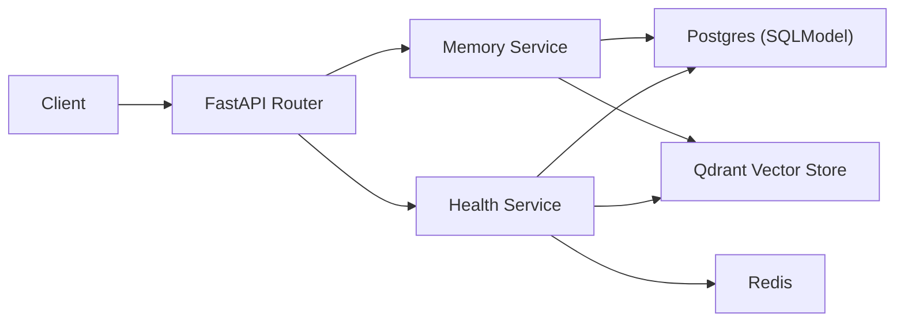

# LifelightMemory Lab (Public Abstraction of Lifelight App 4.0 Memory Core)

[](https://github.com/xiaosen3333/LifelightMemory-Lab/actions/workflows/backend-ci.yml)

[中文 README](README.md)

> The company project is proprietary and cannot be open-sourced.  
> This repository is a public-safe reconstruction of the same stack and engineering approach.

This project represents the core Memory capability in Lifelight App 4.0: making the system truly understand users by extracting memory facts from diary entries and conversations, generating stage-based summaries, and presenting them through a visual Memory Vine plus insight reports.

## Why this repository exists

This repo is built to showcase my backend and DevOps capability in a public hiring context:

- FastAPI service design and API modeling
- Structured storage + vector retrieval (Postgres + Qdrant)
- One-command environment with Docker Compose
- GitHub Actions quality gates (lint/test/build)
- Deployable script with health-check validation

## 4.0 Production Highlights (Public Metrics from Company Project)

The following metrics summarize my work on the Memory capability in the 4.0 release of the company product:

- Owned the core Memory capability (Memory Vine), and delivered the full chain: diary/session -> fact extraction -> profile generation -> user-feedback loop.
- In launch week (2025-09-13 to 2025-09-19), Memory main-path penetration reached `88.56%` (`6044/6825`, deduplicated by `chat_session` users), becoming a core user path.
- Designed the Memory Vine structure for fact visualization and designed the insight-report experience.
- Under the Memory service metric, D7 active retention improved from `1.30%` to `2.01%` (`+0.71pp`); diary-based D7 improved from `0.77%` to `0.97%` (`+0.20pp`).
- Based on `user_profiles` feedback data, the 4.0 memory report feature reached `90.84%` explicit positive rate (`23396/(23396+2358)`), then stabilized at `92%+` monthly.
- Supported large-scale online workloads: `chat_session` ~ `1.9M+`, `chat_session_messages` ~ `6M+`, `user_profiles` ~ `440K+`, `user_profiles_facts` ~ `1.98M+`.
- Reliability-focused engineering included streaming APIs, async background tasks, Redis queueing (dedupe/retry/visibility), profile consistency checks, and automated cleanup.

## Product Screenshots (4 Images)

### 1) Memory Vine Main View


### 2) Memory Theme Visualization (Theme Selector)


### 3) Stage-Based Memory Insight Card


### 4) Memory Insight Report (Radar + Journey)


## System capabilities

- `POST /v1/memory/ingest`: store one user memory text
- `POST /v1/memory/search`: semantic retrieval scoped by user with lexical fallback
- `GET /v1/health`: dependency health for API, DB, Redis, and Qdrant

## What I owned

- Architecture: layering, data model, retrieval/fallback strategy
- Implementation: FastAPI + SQLModel + Qdrant client
- Engineering quality: Makefile, tests, lint, GitHub CI
- DevOps: container orchestration, env management, deploy and health checks

## Architecture



## Open-source boundary

The following elements exist in the company environment but are intentionally excluded here:

- Private business rules and production schema details
- Internal model configuration, prompts, and risk-control logic
- Production network topology and secret management
- Real user data and logs

This repository reproduces the engineering method and stack, not the production code.

## Quick start

### 1) Local Python mode

```bash
git clone https://github.com/xiaosen3333/LifelightMemory-Lab.git
cd LifelightMemory-Lab
cp .env.example .env
make install
make run
```

API docs: `http://127.0.0.1:8000/docs`

### 2) Docker Compose mode

```bash
cp .env.example .env
docker compose up --build -d
curl http://127.0.0.1:8000/v1/health
```

## API examples

```bash
# Ingest
curl -X POST 'http://127.0.0.1:8000/v1/memory/ingest' \
  -H 'Content-Type: application/json' \
  -H 'X-API-Key: dev-api-key' \
  -d '{"user_id":"u-1001","content":"I practiced backend system design today.","language":"en-US"}'

# Search
curl -X POST 'http://127.0.0.1:8000/v1/memory/search' \
  -H 'Content-Type: application/json' \
  -H 'X-API-Key: dev-api-key' \
  -d '{"user_id":"u-1001","query":"system design","limit":5}'
```

## Engineering and DevOps signals

- `Makefile`: one-command lint/test/run/up/down
- `docker-compose.yml`: app + postgres + redis + qdrant
- `scripts/deploy_standalone.sh`: deploy + health check
- `.github/workflows/backend-ci.yml`: lint + tests + docker build
- `CONTRIBUTING.md`: commit convention + PR checklist

## Project structure

```text
LifelightMemory-Lab/
├── app/
│   ├── api/
│   ├── core/
│   ├── db/
│   └── services/
├── tests/
├── scripts/
├── docs/
├── .github/workflows/
├── docker-compose.yml
├── Dockerfile
├── Makefile
└── README.md
```

## Mapping to company-project experience

- Multi-router memory core: mapped to `api + services`
- Vector retrieval with fallback: mapped to `vector_store + lexical fallback`
- Deployment and health governance: mapped to `docker-compose + deploy script + health endpoint`
