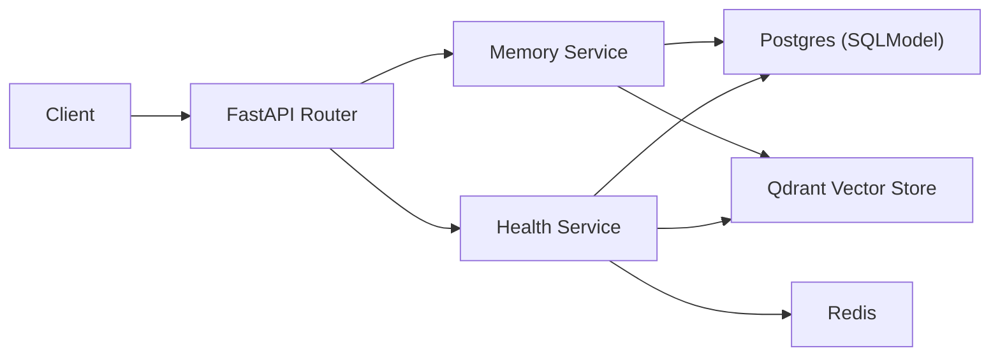

# LifelightMemory Lab（公开抽象版）

[](https://github.com/xiaosen3333/LifelightMemory-Lab/actions/workflows/backend-ci.yml)

[English README](README.en.md)

> 公司项目无法开源，这里是同栈的复刻/练手版本/抽象模块。  
> 本仓库用于公开展示后端与运维工程能力，不包含任何公司敏感实现。

## 这个仓库的目的

用于求职场景展示我的后端与运维能力：

- FastAPI 服务建模与接口设计
- 结构化存储 + 向量检索（Postgres + Qdrant）
- Docker Compose 一键拉起完整系统
- GitHub Actions 质量门禁（lint/test/build）
- 可执行部署脚本（健康检查 + 自动失败退出）

## 系统能力

- `POST /v1/memory/ingest`：写入用户记忆文本
- `POST /v1/memory/search`：按用户范围进行语义检索，自动词法降级
- `GET /v1/health`：返回 API、DB、Redis、Qdrant 健康状态

## 我负责的内容

- 架构设计：分层、数据模型、检索与降级策略
- 代码实现：FastAPI + SQLModel + Qdrant client
- 工程化：Makefile、测试、lint、GitHub CI
- 运维能力：容器编排、环境变量管理、部署脚本与健康检查

## 架构图



## 可公开边界说明

下列内容在公司环境中存在，但本仓库不包含：

- 私有业务规则与线上数据结构细节
- 公司内部模型配置、Prompt、风控策略
- 生产网络拓扑与密钥体系
- 真实用户数据与日志

本仓库复刻的是工程方法与技术栈，不是生产代码拷贝。

## 快速开始

### 1）本地 Python 运行

```bash
git clone https://github.com/xiaosen3333/LifelightMemory-Lab.git
cd LifelightMemory-Lab
cp .env.example .env
make install
make run
```

API 文档：`http://127.0.0.1:8000/docs`

### 2）Docker Compose 运行

```bash
cp .env.example .env
docker compose up --build -d
curl http://127.0.0.1:8000/v1/health
```

## API 示例

```bash
# Ingest
curl -X POST 'http://127.0.0.1:8000/v1/memory/ingest' \
  -H 'Content-Type: application/json' \
  -H 'X-API-Key: dev-api-key' \
  -d '{"user_id":"u-1001","content":"I practiced backend system design today.","language":"en-US"}'

# Search
curl -X POST 'http://127.0.0.1:8000/v1/memory/search' \
  -H 'Content-Type: application/json' \
  -H 'X-API-Key: dev-api-key' \
  -d '{"user_id":"u-1001","query":"system design","limit":5}'
```

## 工程化与运维信号

- `Makefile`：一键 lint/test/run/up/down
- `docker-compose.yml`：app + postgres + redis + qdrant
- `scripts/deploy_standalone.sh`：部署 + 健康检查
- `.github/workflows/backend-ci.yml`：lint + tests + docker build
- `CONTRIBUTING.md`：commit 规范 + PR 检查清单

## 目录结构

```text
LifelightMemory-Lab/
├── app/
│   ├── api/
│   ├── core/
│   ├── db/
│   └── services/
├── tests/
├── scripts/
├── docs/
├── .github/workflows/
├── docker-compose.yml
├── Dockerfile
├── Makefile
└── README.en.md
```

## 与公司项目能力映射

- 多路由 + 记忆处理核心：映射到 `api + services` 分层
- 向量检索 + 降级策略：映射到 `vector_store + lexical fallback`
- 部署与健康治理：映射到 `docker-compose + deploy script + health endpoint`
