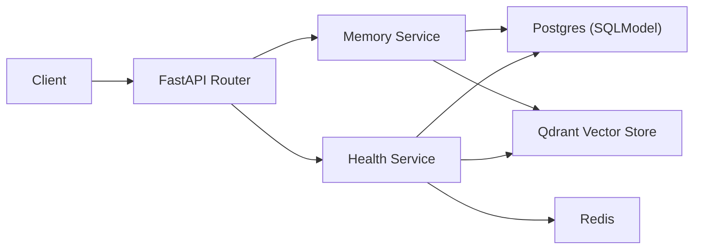

# LifelightMemory Lab (Public Abstraction)

[](https://github.com/xiaosen3333/LifelightMemory-Lab/actions/workflows/backend-ci.yml)

> 实习公司项目无法开源，这里是同栈的复刻/练手版本/抽象模块。  
> The production codebase is not open-source. This repo is a public-safe reconstruction of the same backend stack and engineering approach.

## Why this repo exists

这个仓库用于在求职场景展示我在后端与运维方向的能力：

- FastAPI 服务建模与接口设计
- 结构化存储 + 向量检索（Postgres + Qdrant）
- Docker Compose 一键拉起完整系统
- GitHub Actions 质量门禁（lint/test/build）
- 可执行部署脚本（健康检查 + 滚动重启）

## What this system does

- `POST /v1/memory/ingest`：写入一条用户记忆（文本）。
- `POST /v1/memory/search`：按用户范围进行语义检索（Qdrant）并自动降级为词法检索。
- `GET /v1/health`：返回 API、DB、Redis、Qdrant 健康状态。

## What I owned

- 架构设计：API 分层、数据模型、检索与降级策略。
- 开发实现：FastAPI + SQLModel + Qdrant client。
- 工程化：Makefile、测试、lint、GitHub CI。
- 运维能力：容器化编排、环境变量管理、部署脚本与健康检查。

## Architecture



## Open-source boundary (important)

下列内容在公司环境中存在，但本仓库只保留抽象思路，不包含任何敏感实现：

- 私有业务规则与线上数据结构细节
- 公司内部模型配置、Prompt、风控策略
- 生产环境网络拓扑与密钥体系
- 真实用户数据与日志

本仓库通过公开可运行的方式复刻核心工程能力，而不是复制生产代码。

## Quick start

### 1) Local Python mode

```bash
git clone https://github.com/xiaosen3333/LifelightMemory-Lab.git
cd LifelightMemory-Lab
cp .env.example .env
make install
make run
```

访问 API 文档：`http://127.0.0.1:8000/docs`

### 2) Docker Compose mode

```bash
cp .env.example .env
docker compose up --build -d
curl http://127.0.0.1:8000/v1/health
```

## API examples

```bash
# Ingest
curl -X POST 'http://127.0.0.1:8000/v1/memory/ingest' \
  -H 'Content-Type: application/json' \
  -H 'X-API-Key: dev-api-key' \
  -d '{"user_id":"u-1001","content":"I practiced backend system design today.","language":"en-US"}'

# Search
curl -X POST 'http://127.0.0.1:8000/v1/memory/search' \
  -H 'Content-Type: application/json' \
  -H 'X-API-Key: dev-api-key' \
  -d '{"user_id":"u-1001","query":"system design","limit":5}'
```

## Engineering and DevOps signals shown

- `Makefile`: one-command lint/test/run/up/down
- `docker-compose.yml`: app + postgres + redis + qdrant
- `scripts/deploy_standalone.sh`: image update + health check
- `.github/workflows/backend-ci.yml`: lint + tests + docker build
- `CONTRIBUTING.md`: commit convention + PR quality checklist

## Project structure

```text
LifelightMemory-Lab/
├── app/
│   ├── api/
│   ├── core/
│   ├── db/
│   └── services/
├── tests/
├── scripts/
├── docs/
├── .github/workflows/
├── docker-compose.yml
├── Dockerfile
└── Makefile
```

## Mapping to private production experience

- 生产项目中的“多路由 + 记忆处理核心”：对应本仓库 `api + services` 分层。
- 生产项目中的“向量检索与回退策略”：对应本仓库 `vector_store + lexical fallback`。
- 生产项目中的“部署与健康治理”：对应本仓库 `docker-compose + deploy script + health endpoint`。

